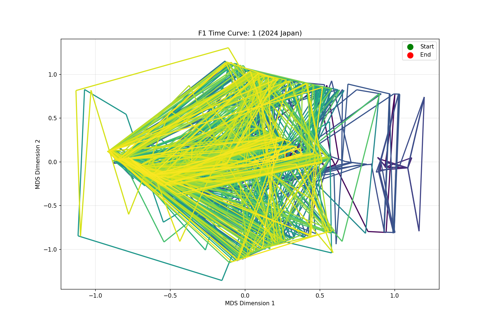
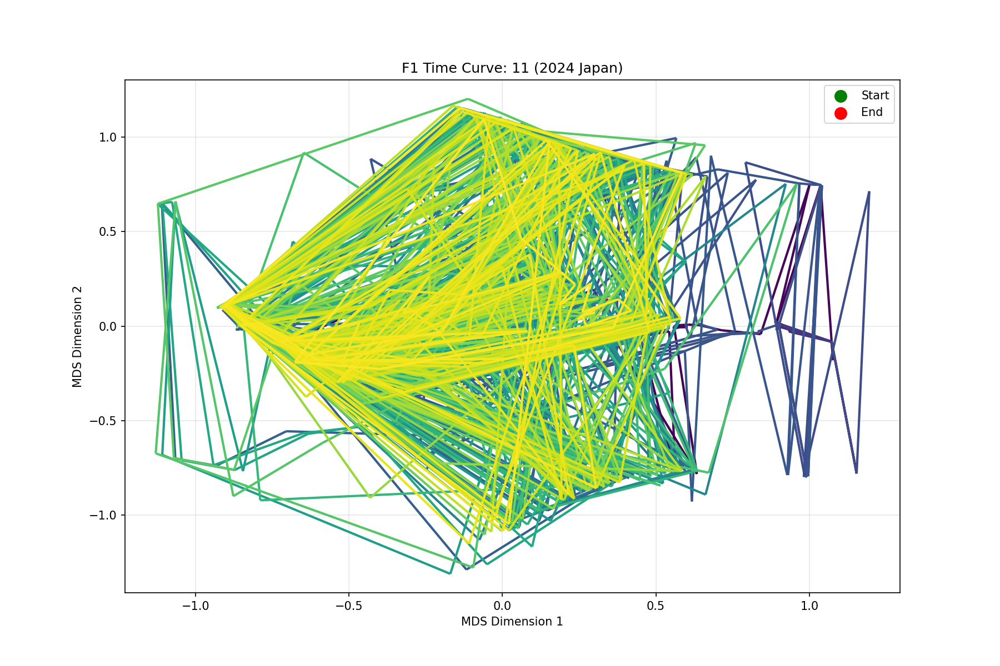
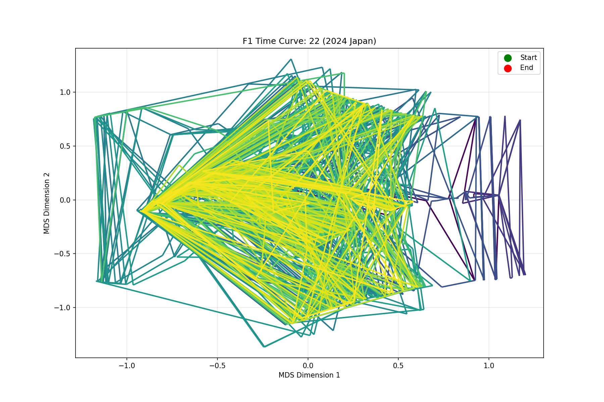
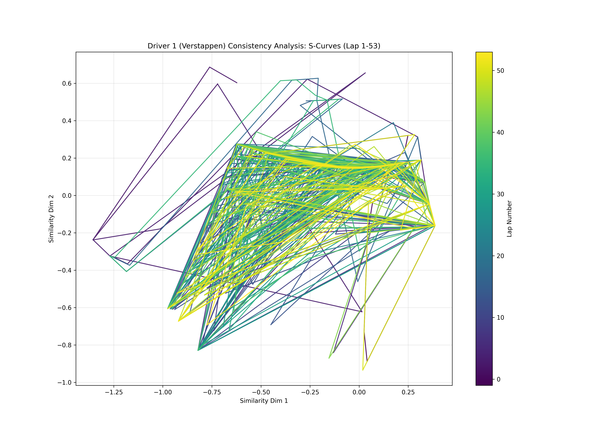
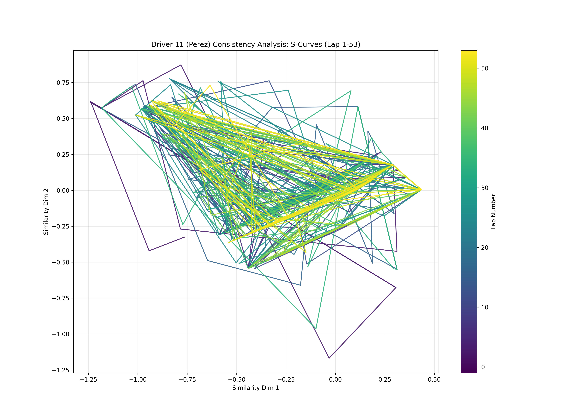
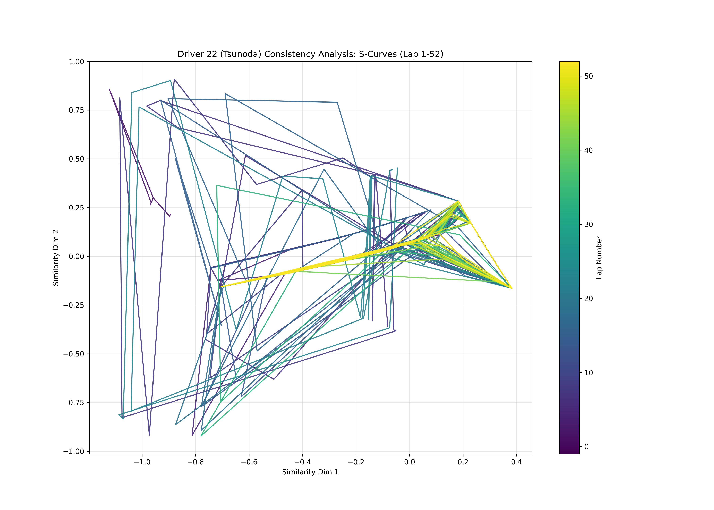
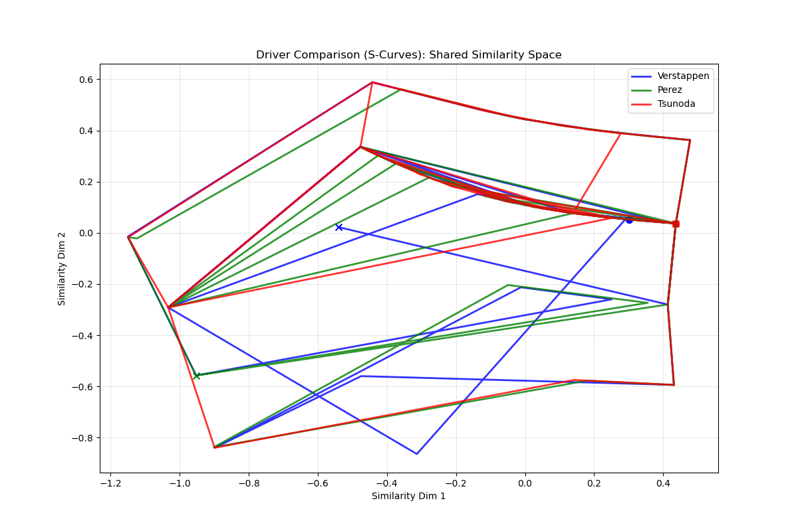
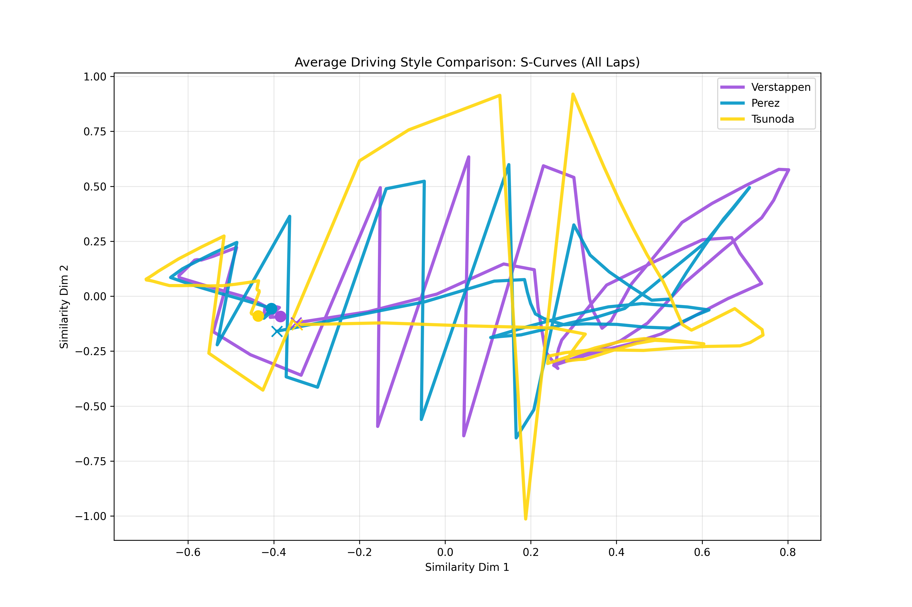
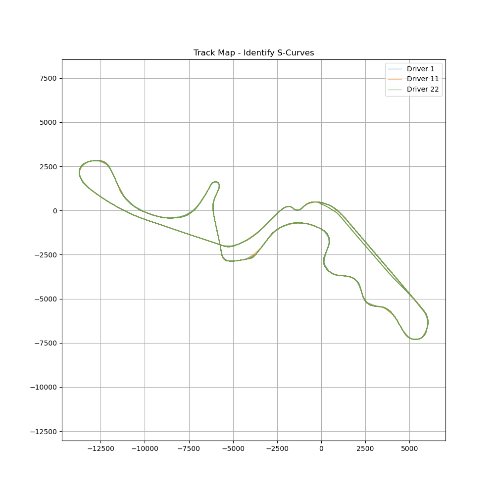
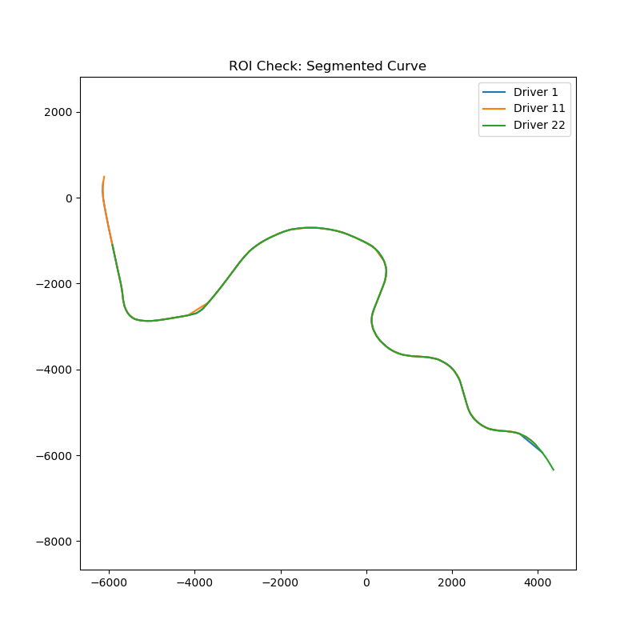

# Visualization Gallery

Here are the generated results for the 2024 Japanese GP analysis.

## 1. Global Time Curves
Visualizing the driver's state evolution over the entire race.

### Max Verstappen (Driver 1)

### Sergio Perez (Driver 11)

### Yuki Tsunoda (Driver 22)

---

## 2. Driver Consistency (S-Curves)
analyzing how consistent a driver is through the S-Curves across 53 laps.

### Max Verstappen

### Sergio Perez

### Yuki Tsunoda

---

## 3. Style Comparison
Comparing the average driving style of the three drivers in the S-Curves.

### S-Curve Comparison

### Average Styles

---

## 4. Track Map & ROI

ROI Check:

